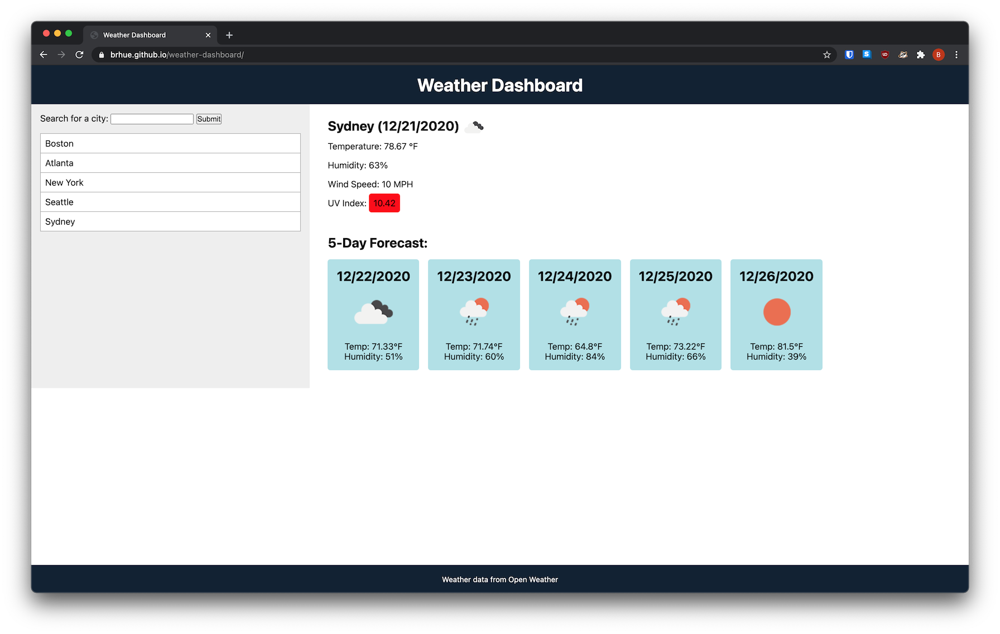
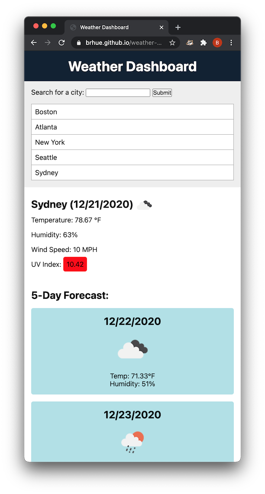

# weather-dashboard

## Description
This is a simple weather dashboard that uses the [Open Weather API](https://openweathermap.org/api/). It features:
- a recent searches list that persists through page refresh via `localstorage`
- mobile-first responsive design
- error message when a city cannot be found

Also makes use of [jQuery](https://jquery.com) for easier ajax handling. Check out the [live](https://brhue.github.io/weather-dashboard/) version.
## Installation
Clone the repository to your local machine.
## Usage
Open `index.html` in your favorite browser. Then enter a city to get the current weather!
## Credits

## License
MIT
